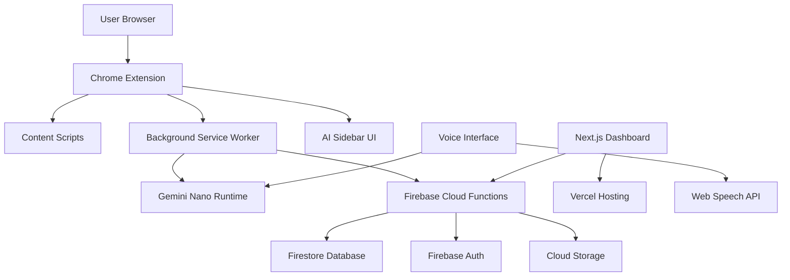

# Design Document

## Overview

Kiro is a hybrid web application and Chrome extension that creates an intelligent browser assistant experience. The system combines local AI processing (Gemini Nano) with cloud services (Firebase) to provide contextual assistance while maintaining user privacy. The architecture follows a client-server model with the Chrome extension serving as the primary interface and a Next.js web dashboard for management and insights.

## Architecture

### High-Level Architecture



### System Components

1. **Chrome Extension Layer**
   - Manifest V3 extension with content scripts and service worker
   - AI Sidebar component for contextual interactions
   - Privacy Sandbox integration for secure data handling

2. **Local AI Processing**
   - Gemini Nano for on-device text processing and summarization
   - Chrome AI APIs for browser context analysis
   - Local storage for temporary context and user preferences

3. **Cloud Backend**
   - Firebase Functions for complex AI operations requiring cloud processing
   - Firestore for user data, automation rules, and knowledge graph
   - Firebase Auth for secure user authentication

4. **Web Dashboard**
   - Next.js application with App Router
   - Real-time data synchronization with Firebase
   - Visual knowledge graph and analytics interface

## Components and Interfaces

### Chrome Extension Components

#### Content Script (`content.js`)
```javascript
// Interface for page context analysis
interface PageContext {
  url: string;
  title: string;
  selectedText?: string;
  formFields?: FormField[];
  pageType: 'article' | 'form' | 'search' | 'social' | 'other';
}

// Main content script functionality
class KiroContentScript {
  analyzePageContext(): PageContext;
  injectSidebar(): void;
  handleTextSelection(): void;
  detectFormInteraction(): void;
}
```

#### Background Service Worker (`background.js`)
```javascript
// Interface for AI processing coordination
interface AIRequest {
  type: 'summarize' | 'suggest' | 'automate' | 'analyze';
  context: PageContext;
  userInput?: string;
}

class KiroBackground {
  processAIRequest(request: AIRequest): Promise<AIResponse>;
  managePermissions(): void;
  syncWithCloud(): void;
  handleVoiceCommands(): void;
}
```

#### AI Sidebar Component
```typescript
interface SidebarProps {
  context: PageContext;
  suggestions: Suggestion[];
  isVisible: boolean;
}

const AISidebar: React.FC<SidebarProps> = ({
  context,
  suggestions,
  isVisible
}) => {
  // Floating sidebar with glass morphism design
  // Voice activation button
  // Contextual action buttons
  // Mini chat interface
};
```

### Next.js Dashboard Components

#### Dashboard Layout
```typescript
// Main dashboard structure
const DashboardLayout = () => (
  <div className="min-h-screen bg-gray-950">
    <Sidebar />
    <main className="ml-60 p-8">
      <Header />
      <ContentArea />
    </main>
  </div>
);
```

#### Knowledge Graph Visualization
```typescript
interface KnowledgeNode {
  id: string;
  label: string;
  type: 'topic' | 'website' | 'action' | 'preference';
  connections: string[];
  strength: number;
}

const KnowledgeGraph: React.FC<{
  nodes: KnowledgeNode[];
  onNodeClick: (node: KnowledgeNode) => void;
}> = ({ nodes, onNodeClick }) => {
  // D3.js or React Flow implementation
  // Interactive node visualization
  // Connection strength indicators
};
```

#### Automation Hub
```typescript
interface AutomationRule {
  id: string;
  name: string;
  trigger: TriggerCondition;
  actions: Action[];
  isActive: boolean;
}

const AutomationHub: React.FC = () => {
  // Visual automation builder
  // Trigger condition editor
  // Action sequence designer
  // Rule testing interface
};
```

### Firebase Backend Structure

#### Cloud Functions
```typescript
// AI processing function
export const processAIRequest = functions.https.onCall(
  async (data: AIRequest, context) => {
    // Validate user authentication
    // Process request with Vertex AI for complex operations
    // Return structured response
  }
);

// User data synchronization
export const syncUserData = functions.firestore
  .document('users/{userId}/activity/{activityId}')
  .onCreate(async (snap, context) => {
    // Update knowledge graph
    // Trigger automation rules
    // Generate insights
  });
```

#### Firestore Data Model
```typescript
// User document structure
interface UserDocument {
  id: string;
  email: string;
  preferences: UserPreferences;
  knowledgeGraph: KnowledgeNode[];
  automationRules: AutomationRule[];
  activityHistory: ActivityRecord[];
}

// Activity tracking
interface ActivityRecord {
  timestamp: Timestamp;
  url: string;
  action: string;
  context: PageContext;
  aiResponse?: string;
}
```

## Data Models

### Core Data Structures

#### User Preferences
```typescript
interface UserPreferences {
  privacy: {
    dataCollection: 'minimal' | 'standard' | 'comprehensive';
    cloudSync: boolean;
    voiceData: boolean;
  };
  ui: {
    theme: 'dark' | 'light' | 'auto';
    sidebarPosition: 'left' | 'right';
    animationsEnabled: boolean;
  };
  ai: {
    summaryLength: 'brief' | 'detailed';
    suggestionFrequency: 'low' | 'medium' | 'high';
    voiceEnabled: boolean;
  };
}
```

#### Context Analysis
```typescript
interface ContextAnalysis {
  pageType: string;
  mainTopic: string;
  keyEntities: string[];
  userIntent: 'reading' | 'researching' | 'shopping' | 'working';
  relevantSuggestions: Suggestion[];
  automationOpportunities: AutomationOpportunity[];
}
```

#### Integration Data
```typescript
interface ServiceIntegration {
  service: 'gmail' | 'youtube' | 'notion' | 'drive' | 'slack';
  isConnected: boolean;
  permissions: string[];
  lastSync: Timestamp;
  syncedData: {
    emails?: EmailSummary[];
    documents?: DocumentReference[];
    messages?: MessageThread[];
  };
}
```

## Error Handling

### Error Categories and Responses

#### AI Processing Errors
```typescript
class AIProcessingError extends Error {
  constructor(
    message: string,
    public code: 'QUOTA_EXCEEDED' | 'MODEL_UNAVAILABLE' | 'INVALID_INPUT'
  ) {
    super(message);
  }
}

// Error handling strategy
const handleAIError = (error: AIProcessingError) => {
  switch (error.code) {
    case 'QUOTA_EXCEEDED':
      return fallbackToLocalProcessing();
    case 'MODEL_UNAVAILABLE':
      return showOfflineMode();
    case 'INVALID_INPUT':
      return requestUserClarification();
  }
};
```

#### Privacy and Permission Errors
```typescript
class PrivacyError extends Error {
  constructor(
    message: string,
    public requiredPermission: string
  ) {
    super(message);
  }
}

// Graceful permission handling
const requestPermissionGracefully = async (permission: string) => {
  try {
    const granted = await chrome.permissions.request({ permissions: [permission] });
    if (!granted) {
      showPermissionExplanation(permission);
    }
    return granted;
  } catch (error) {
    logError(error);
    return false;
  }
};
```

#### Network and Sync Errors
```typescript
// Offline-first approach with sync retry
class SyncManager {
  private retryQueue: SyncOperation[] = [];
  
  async syncWithRetry(operation: SyncOperation) {
    try {
      await this.performSync(operation);
    } catch (error) {
      this.retryQueue.push(operation);
      this.scheduleRetry();
    }
  }
  
  private scheduleRetry() {
    setTimeout(() => {
      this.processRetryQueue();
    }, this.getBackoffDelay());
  }
}
```

## Testing Strategy

### Unit Testing Approach

#### Chrome Extension Testing
```typescript
// Mock Chrome APIs for testing
const mockChrome = {
  runtime: {
    sendMessage: jest.fn(),
    onMessage: { addListener: jest.fn() }
  },
  tabs: {
    query: jest.fn(),
    sendMessage: jest.fn()
  }
};

// Test content script functionality
describe('KiroContentScript', () => {
  beforeEach(() => {
    global.chrome = mockChrome;
  });
  
  test('should analyze page context correctly', () => {
    const script = new KiroContentScript();
    const context = script.analyzePageContext();
    expect(context.pageType).toBeDefined();
  });
});
```

#### AI Processing Testing
```typescript
// Mock Gemini Nano responses
const mockGeminiResponse = {
  summary: 'Test summary',
  suggestions: ['suggestion1', 'suggestion2']
};

describe('AI Processing', () => {
  test('should generate contextual suggestions', async () => {
    const processor = new AIProcessor();
    const result = await processor.generateSuggestions(mockContext);
    expect(result.suggestions).toHaveLength(2);
  });
});
```

### Integration Testing

#### End-to-End User Flows
```typescript
// Playwright tests for complete user journeys
describe('Kiro E2E Tests', () => {
  test('user can install extension and see sidebar', async ({ page }) => {
    await page.goto('https://example.com');
    await page.click('[data-testid="kiro-activate"]');
    await expect(page.locator('[data-testid="ai-sidebar"]')).toBeVisible();
  });
  
  test('voice commands work correctly', async ({ page }) => {
    await page.goto('/dashboard');
    await page.click('[data-testid="voice-button"]');
    // Simulate voice input
    await page.evaluate(() => {
      window.speechRecognition.mockResult('summarize this page');
    });
    await expect(page.locator('[data-testid="summary"]')).toBeVisible();
  });
});
```

### Performance Testing

#### Load Testing for Firebase Functions
```typescript
// Artillery.js configuration for load testing
const loadTestConfig = {
  target: 'https://us-central1-kiro-project.cloudfunctions.net',
  phases: [
    { duration: 60, arrivalRate: 10 },
    { duration: 120, arrivalRate: 50 }
  ],
  scenarios: [
    {
      name: 'AI Processing Load',
      requests: [
        {
          post: {
            url: '/processAIRequest',
            json: { type: 'summarize', context: mockContext }
          }
        }
      ]
    }
  ]
};
```

#### Chrome Extension Performance Monitoring
```typescript
// Performance metrics collection
class PerformanceMonitor {
  measureSidebarRenderTime() {
    const start = performance.now();
    // Render sidebar
    const end = performance.now();
    this.logMetric('sidebar_render_time', end - start);
  }
  
  measureAIResponseTime() {
    // Track AI processing latency
    // Log to analytics service
  }
}
```

## Security Considerations

### Data Privacy Implementation
- All sensitive data processing happens locally with Gemini Nano
- Cloud storage uses Firebase Security Rules for access control
- User consent management with granular permissions
- Automatic data deletion after user-specified retention periods

### Chrome Extension Security
- Content Security Policy (CSP) implementation
- Secure communication between content scripts and background worker
- Input sanitization for all user-generated content
- Regular security audits of third-party dependencies

### API Security
- Firebase Auth integration with secure token validation
- Rate limiting on Cloud Functions
- Input validation and sanitization
- HTTPS enforcement for all communications