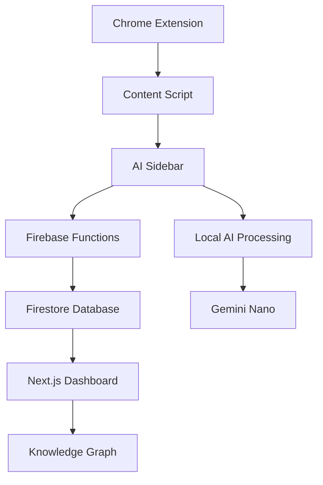

# Kiro Web Mind Developer Guide

## Table of Contents
1. [Development Setup](#development-setup)
2. [Project Structure](#project-structure)
3. [Architecture Overview](#architecture-overview)
4. [Development Workflow](#development-workflow)
5. [Testing](#testing)
6. [Chrome Extension Development](#chrome-extension-development)
7. [Firebase Integration](#firebase-integration)
8. [AI Integration](#ai-integration)
9. [Deployment](#deployment)
10. [Contributing](#contributing)

## Development Setup

### Prerequisites

- **Node.js**: Version 18 or higher
- **npm**: Version 8 or higher
- **Chrome Browser**: For extension testing
- **Firebase CLI**: For backend development
- **Git**: For version control

### Installation

1. **Clone the repository:**
   ```bash
   git clone https://github.com/your-org/kiro-web-mind.git
   cd kiro-web-mind
   ```

2. **Install dependencies:**
   ```bash
   npm install
   ```

3. **Set up environment variables:**
   ```bash
   cp .env.example .env.local
   # Edit .env.local with your configuration
   ```

4. **Install Firebase CLI:**
   ```bash
   npm install -g firebase-tools
   firebase login
   ```

5. **Initialize Firebase:**
   ```bash
   firebase init
   # Select Firestore, Functions, and Hosting
   ```

### Environment Configuration

Create `.env.local` with the following variables:

```env
# Firebase Configuration
NEXT_PUBLIC_FIREBASE_API_KEY=your-api-key
NEXT_PUBLIC_FIREBASE_AUTH_DOMAIN=your-project.firebaseapp.com
NEXT_PUBLIC_FIREBASE_PROJECT_ID=your-project-id
NEXT_PUBLIC_FIREBASE_STORAGE_BUCKET=your-project.appspot.com
NEXT_PUBLIC_FIREBASE_MESSAGING_SENDER_ID=your-sender-id
NEXT_PUBLIC_FIREBASE_APP_ID=your-app-id

# Development Configuration
NEXT_PUBLIC_APP_ENV=development
NEXT_PUBLIC_API_URL=http://localhost:5001/your-project/us-central1

# AI Configuration
NEXT_PUBLIC_GEMINI_API_KEY=your-gemini-api-key
```

## Project Structure

```
kiro-web-mind/
├── app/                    # Next.js App Router pages
│   ├── dashboard/         # Dashboard pages
│   ├── chat/             # Chat interface
│   └── layout.tsx        # Root layout
├── components/           # React components
│   ├── ui/              # Reusable UI components
│   ├── voice/           # Voice interface components
│   ├── automation/      # Automation components
│   └── knowledge/       # Knowledge graph components
├── lib/                 # Utility libraries
│   ├── ai/             # AI processing utilities
│   ├── firebase/       # Firebase integration
│   ├── voice/          # Voice processing
│   └── types/          # TypeScript type definitions
├── extension/          # Chrome extension files
│   ├── manifest.json   # Extension manifest
│   ├── background.js   # Service worker
│   ├── content.js      # Content script
│   └── popup.html      # Extension popup
├── functions/          # Firebase Cloud Functions
├── __tests__/          # Test files
├── docs/              # Documentation
└── scripts/           # Build and deployment scripts
```

## Architecture Overview

### System Components

1. **Next.js Web Application**
   - Dashboard interface
   - User management
   - Knowledge graph visualization
   - Automation management

2. **Chrome Extension**
   - Content script injection
   - AI sidebar interface
   - Background service worker
   - Browser integration

3. **Firebase Backend**
   - Firestore database
   - Cloud Functions API
   - Authentication
   - Real-time synchronization

4. **AI Processing**
   - Local processing with Gemini Nano
   - Cloud processing for complex operations
   - Voice recognition and synthesis

### Data Flow



## Development Workflow

### Starting Development

1. **Start the development server:**
   ```bash
   npm run dev
   ```

2. **Start Firebase emulators:**
   ```bash
   firebase emulators:start
   ```

3. **Load extension in Chrome:**
   - Open Chrome and go to `chrome://extensions/`
   - Enable "Developer mode"
   - Click "Load unpacked" and select the `extension/` folder

### Development Commands

```bash
# Development
npm run dev                 # Start Next.js dev server
npm run dev:firebase       # Start Firebase emulators

# Building
npm run build              # Build Next.js app
npm run build:production   # Build for production
npm run extension:build    # Build Chrome extension

# Testing
npm run test              # Run tests
npm run test:watch        # Run tests in watch mode
npm run test:coverage     # Generate coverage report

# Linting and Formatting
npm run lint              # Run ESLint
npm run lint:fix          # Fix linting issues
npm run format            # Format code with Prettier

# Deployment
npm run deploy:web        # Deploy web app
npm run deploy:extension  # Package extension
npm run deploy:all        # Deploy everything
```

### Code Style and Standards

We use the following tools for code quality:

- **ESLint**: For code linting
- **Prettier**: For code formatting
- **TypeScript**: For type safety
- **Husky**: For Git hooks
- **Conventional Commits**: For commit messages

### Git Workflow

1. **Create a feature branch:**
   ```bash
   git checkout -b feature/your-feature-name
   ```

2. **Make your changes and commit:**
   ```bash
   git add .
   git commit -m "feat: add new feature"
   ```

3. **Push and create a pull request:**
   ```bash
   git push origin feature/your-feature-name
   ```

## Testing

### Test Structure

```
__tests__/
├── ai/                    # AI processing tests
├── extension/             # Chrome extension tests
├── firebase/              # Firebase integration tests
├── integration/           # End-to-end integration tests
├── sync/                  # Data synchronization tests
├── voice/                 # Voice interface tests
└── setup.ts              # Test configuration
```

### Running Tests

```bash
# Run all tests
npm test

# Run specific test suites
npm test -- __tests__/ai/
npm test -- __tests__/extension/

# Run tests with coverage
npm run test:coverage

# Run tests in watch mode
npm run test:watch
```

### Writing Tests

#### Unit Test Example

```typescript
// __tests__/ai/ai-service.test.ts
import { AIService } from '../../lib/ai/ai-service';

describe('AIService', () => {
  let aiService: AIService;

  beforeEach(() => {
    aiService = new AIService();
  });

  test('should summarize text correctly', async () => {
    const text = 'Long article content...';
    const summary = await aiService.summarize(text);
    
    expect(summary).toBeDefined();
    expect(summary.length).toBeLessThan(text.length);
  });
});
```

#### Integration Test Example

```typescript
// __tests__/integration/extension-dashboard.test.ts
import { render, screen } from '@testing-library/react';
import { Dashboard } from '../../components/Dashboard';

describe('Extension-Dashboard Integration', () => {
  test('should sync data between extension and dashboard', async () => {
    // Test implementation
  });
});
```

## Chrome Extension Development

### Extension Architecture

The Chrome extension consists of:

1. **Manifest V3**: Modern extension configuration
2. **Service Worker**: Background processing
3. **Content Scripts**: Page interaction
4. **Popup**: Quick access interface
5. **Sidebar**: AI interface injection

### Key Files

#### manifest.json
```json
{
  "manifest_version": 3,
  "name": "Kiro Web Mind",
  "version": "1.0.0",
  "permissions": ["activeTab", "storage", "scripting"],
  "background": {
    "service_worker": "background.js"
  },
  "content_scripts": [{
    "matches": ["<all_urls>"],
    "js": ["content.js"]
  }]
}
```

#### background.js
```javascript
// Service worker for background processing
chrome.runtime.onMessage.addListener((message, sender, sendResponse) => {
  if (message.type === 'AI_PROCESS') {
    processWithAI(message.data).then(sendResponse);
    return true; // Async response
  }
});
```

#### content.js
```javascript
// Content script for page interaction
class KiroContentScript {
  constructor() {
    this.initializeSidebar();
    this.setupEventListeners();
  }

  initializeSidebar() {
    // Inject AI sidebar into page
  }

  setupEventListeners() {
    // Listen for text selection, page changes, etc.
  }
}

new KiroContentScript();
```

### Extension Development Tips

1. **Use Chrome DevTools**: Debug extension with Chrome DevTools
2. **Test Permissions**: Ensure minimal required permissions
3. **Handle Errors**: Graceful error handling for all scenarios
4. **Performance**: Optimize for minimal resource usage
5. **Security**: Follow Chrome extension security best practices

## Firebase Integration

### Firestore Database Structure

```
users/{userId}
├── profile: UserProfile
├── preferences: UserPreferences
├── activities/{activityId}: ActivityRecord
├── automationRules/{ruleId}: AutomationRule
└── knowledgeGraph: KnowledgeGraphData

globalData/
├── analytics: AnalyticsData
└── systemConfig: SystemConfiguration
```

### Cloud Functions

#### Function Structure

```typescript
// functions/src/ai-processing.ts
import { onCall } from 'firebase-functions/v2/https';

export const processAIRequest = onCall(async (request) => {
  const { data, auth } = request;
  
  // Validate authentication
  if (!auth) {
    throw new Error('Unauthenticated');
  }
  
  // Process AI request
  const result = await processWithAI(data);
  
  return { success: true, data: result };
});
```

#### Deployment

```bash
# Deploy all functions
firebase deploy --only functions

# Deploy specific function
firebase deploy --only functions:processAIRequest
```

### Security Rules

```javascript
// firestore.rules
rules_version = '2';
service cloud.firestore {
  match /databases/{database}/documents {
    // Users can only access their own data
    match /users/{userId} {
      allow read, write: if request.auth != null && request.auth.uid == userId;
      
      match /activities/{activityId} {
        allow read, write: if request.auth != null && request.auth.uid == userId;
      }
    }
  }
}
```

## AI Integration

### Gemini Nano Integration

```typescript
// lib/ai/gemini-nano.ts
export class GeminiNanoService {
  private session: any;

  async initialize() {
    if ('ai' in window) {
      this.session = await (window as any).ai.summarizer.create();
    }
  }

  async summarize(text: string): Promise<string> {
    if (!this.session) {
      throw new Error('Gemini Nano not available');
    }
    
    return await this.session.summarize(text);
  }
}
```

### Voice Processing

```typescript
// lib/voice/voice-interface.ts
export class VoiceInterface {
  private recognition: SpeechRecognition;
  private synthesis: SpeechSynthesis;

  constructor() {
    this.recognition = new webkitSpeechRecognition();
    this.synthesis = window.speechSynthesis;
    this.setupRecognition();
  }

  private setupRecognition() {
    this.recognition.continuous = true;
    this.recognition.interimResults = true;
    
    this.recognition.onresult = (event) => {
      // Process speech recognition results
    };
  }
}
```

## Deployment

### Development Deployment

```bash
# Deploy to development environment
npm run deploy:dev
```

### Production Deployment

```bash
# Run pre-deployment checks
npm run predeploy

# Deploy to production
npm run deploy:production
```

### CI/CD Pipeline

We use GitHub Actions for continuous integration and deployment:

```yaml
# .github/workflows/deploy.yml
name: Deploy Kiro Web Mind
on:
  push:
    branches: [main]

jobs:
  test:
    runs-on: ubuntu-latest
    steps:
      - uses: actions/checkout@v4
      - uses: actions/setup-node@v4
      - run: npm ci
      - run: npm test

  deploy:
    needs: test
    runs-on: ubuntu-latest
    steps:
      - uses: actions/checkout@v4
      - run: npm run deploy:production
```

## Contributing

### Getting Started

1. **Fork the repository**
2. **Create a feature branch**
3. **Make your changes**
4. **Write tests**
5. **Submit a pull request**

### Contribution Guidelines

- Follow the existing code style
- Write comprehensive tests
- Update documentation
- Use conventional commit messages
- Ensure all checks pass

### Code Review Process

1. **Automated Checks**: All PRs must pass automated tests
2. **Code Review**: At least one maintainer review required
3. **Documentation**: Update docs for new features
4. **Testing**: Ensure adequate test coverage

### Development Best Practices

1. **Type Safety**: Use TypeScript for all new code
2. **Error Handling**: Implement comprehensive error handling
3. **Performance**: Optimize for performance and user experience
4. **Security**: Follow security best practices
5. **Accessibility**: Ensure accessibility compliance

## Troubleshooting

### Common Issues

#### Extension Not Loading
```bash
# Check extension permissions
chrome://extensions/

# Reload extension
# Check console for errors
```

#### Firebase Connection Issues
```bash
# Check Firebase configuration
firebase projects:list

# Verify environment variables
echo $NEXT_PUBLIC_FIREBASE_PROJECT_ID
```

#### Build Failures
```bash
# Clear cache and reinstall
rm -rf node_modules package-lock.json
npm install

# Check Node.js version
node --version
```

### Debug Tools

- **Chrome DevTools**: For extension debugging
- **Firebase Console**: For backend monitoring
- **React DevTools**: For component debugging
- **Network Tab**: For API request debugging

## Resources

- [Chrome Extension Documentation](https://developer.chrome.com/docs/extensions/)
- [Firebase Documentation](https://firebase.google.com/docs)
- [Next.js Documentation](https://nextjs.org/docs)
- [TypeScript Documentation](https://www.typescriptlang.org/docs/)

## Support

- **GitHub Issues**: [Report bugs and request features](https://github.com/your-org/kiro-web-mind/issues)
- **Discussions**: [Community discussions](https://github.com/your-org/kiro-web-mind/discussions)
- **Developer Chat**: [Join our Discord](https://discord.gg/kiro-web-mind)
- **Email**: developers@kiro-web-mind.com

---

Happy coding! 🚀